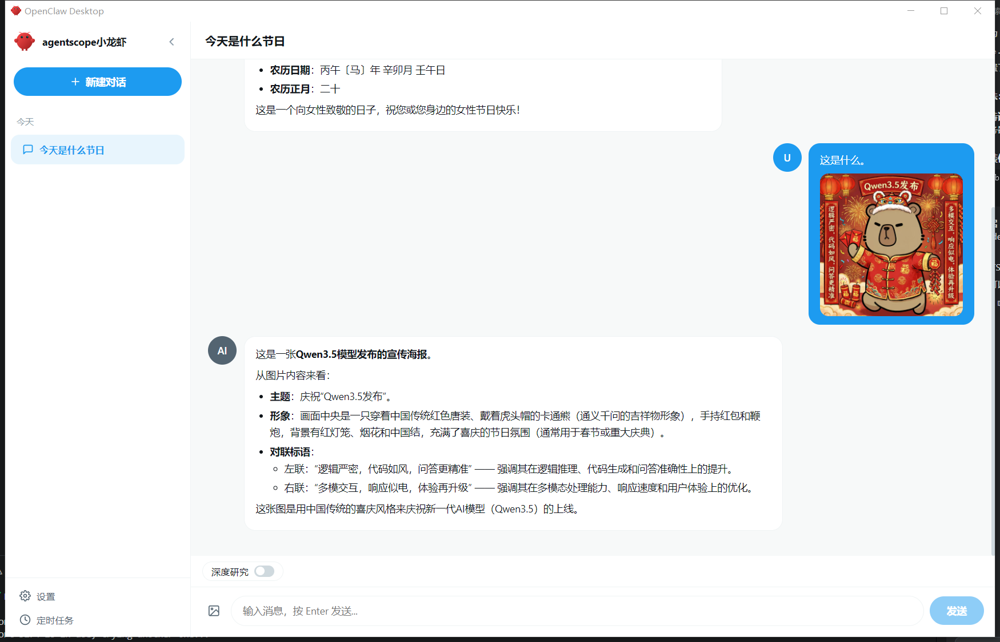
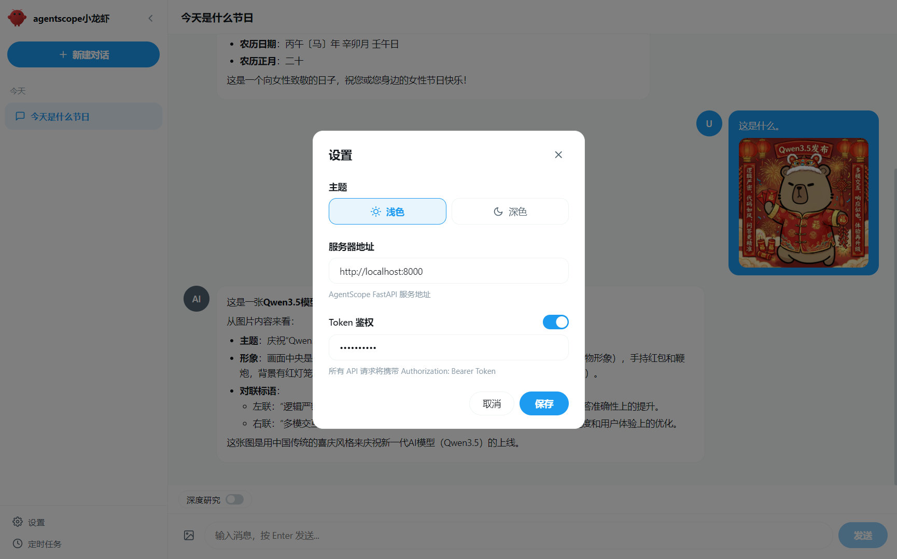
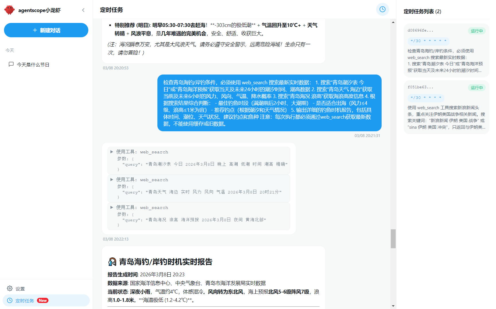
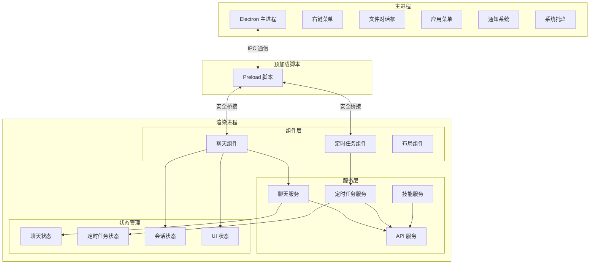

# OpenClaw Desktop

AgentScope OpenClaw 桌面客户端 - 一款支持 AI 对话和任务自动化的现代化桌面应用。

> 本项目为 OpenClaw 的桌面端应用，后端服务请参考 [openclaw](https://github.com/owenliang/openclaw) 项目。

## 界面截图

### 主聊天界面


### 认证界面


### 定时任务管理


## 架构图



## 技术栈

| 类别 | 技术 |
|------|------|
| **框架** | Electron 28 |
| **UI 库** | React 18 |
| **语言** | TypeScript 5.3 |
| **构建工具** | Vite 5 |
| **状态管理** | Zustand |
| **打包工具** | Electron Forge |
| **样式方案** | CSS / Tailwind-ready |

## 项目结构

```
├── src/
│   ├── main/           # Electron 主进程
│   ├── preload.ts      # 预加载脚本（安全 IPC）
│   └── renderer/       # React 渲染进程
│       ├── components/ # UI 组件
│       ├── services/   # API 服务
│       ├── stores/     # Zustand 状态管理
│       └── utils/      # 工具函数
├── images/             # 截图
└── assets/             # 图标和静态资源
```

## 快速开始

```bash
# 安装依赖
npm install

# 启动开发模式
npm run start

# 打包应用
npm run package

# 构建分发包
npm run make
```
